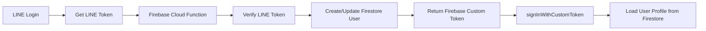
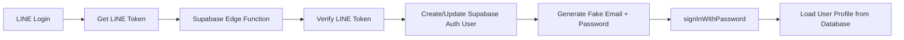

# Firebase vs Supabase Migration Comparison

## Authentication Flow Comparison

### Firebase Approach



### Supabase Approach



## Key Differences

### Authentication Method

- **Firebase**: Uses custom tokens generated by Cloud Functions
- **Supabase**: Uses email/password authentication with generated fake emails

### User Creation

- **Firebase**: Direct user creation in Firestore with custom authentication
- **Supabase**: Creates user in `auth.users` table + custom `user_profiles` table

### Token Handling

- **Firebase**: Returns Firebase custom token for client-side authentication
- **Supabase**: Returns email/password credentials for client-side authentication

## Code Changes

### AuthContext Changes

#### Before (Firebase)

```typescript
import { User } from 'firebase/auth'
import {
  onAuthStateChange,
  signInWithToken,
  getUserData,
  signOut as firebaseSignOut,
  authenticateLineUser,
} from '@/lib/firebase'

// Firebase user type
const [authUser, setUser] = useState<User | null>(null)

// Firebase Cloud Function call
const {
  data: { firebaseToken, isNewUser },
} = await authenticateLineUser({
  token,
  tokenType,
})

// Sign in with custom token
await signInWithToken(firebaseToken)
```

#### After (Supabase)

```typescript
import {
  authenticateLineUser,
  signInWithCredentials,
  getUserProfile,
  signOut as supabaseSignOut,
  onAuthStateChange,
  type UserProfile,
} from '@/lib/supabase'

// Supabase user type
const [authUser, setUser] = useState<any>(null)

// Supabase Edge Function call
const {
  sessionData: { email, password },
  isNewUser: newUser,
  userData,
} = await authenticateLineUser({
  token,
  tokenType,
})

// Sign in with email/password
await signInWithCredentials(email, password)
```

### Database Schema Changes

#### Firebase (Firestore)

```javascript
// Collection: users/{uid}
{
  uid: string,
  displayName: string,
  pictureUrl?: string,
  description?: string,
  createdAt: Timestamp,
  lastLogin: Timestamp,
  providers: {
    line?: {
      userId: string,
      displayName: string,
      pictureUrl?: string,
      email?: string | null,
      lastLogin: Timestamp,
      linkedAt: Timestamp
    }
  }
}
```

#### Supabase (PostgreSQL)

```sql
-- Table: user_profiles
CREATE TABLE user_profiles (
  id UUID REFERENCES auth.users(id) PRIMARY KEY,
  line_user_id TEXT UNIQUE NOT NULL,
  display_name TEXT NOT NULL,
  picture_url TEXT,
  description TEXT,
  created_at TIMESTAMP WITH TIME ZONE DEFAULT NOW(),
  last_login TIMESTAMP WITH TIME ZONE DEFAULT NOW(),
  providers JSONB DEFAULT '{}'
);
```

### Edge Function Differences

#### Firebase Cloud Function (Node.js)

```typescript
import { onCall } from 'firebase-functions/v2/https'
import { getAuth } from 'firebase-admin/auth'
import { getFirestore } from 'firebase-admin/firestore'

export const authenticateLineUser = onCall(async (request) => {
  // Verify LINE token
  // Create/update Firestore user
  // Create Firebase custom token
  const customToken = await getAuth().createCustomToken(uid)
  return { firebaseToken: customToken, isNewUser }
})
```

#### Supabase Edge Function (Deno)

```typescript
import { serve } from 'https://deno.land/std@0.177.0/http/server.ts'
import { createClient } from 'https://esm.sh/@supabase/supabase-js@2'

serve(async (req) => {
  // Verify LINE token
  // Create/update Supabase auth user
  // Create/update user profile
  const email = `line_${lineProfile.userId}@line.local`
  const password = generateSecurePassword()
  return { sessionData: { email, password }, isNewUser }
})
```

## Environment Variables

### Firebase

```bash
NEXT_PUBLIC_FIREBASE_API_KEY=
NEXT_PUBLIC_FIREBASE_AUTH_DOMAIN=
NEXT_PUBLIC_FIREBASE_PROJECT_ID=
NEXT_PUBLIC_FIREBASE_STORAGE_BUCKET=
NEXT_PUBLIC_FIREBASE_MESSAGING_SENDER_ID=
NEXT_PUBLIC_FIREBASE_APP_ID=
NEXT_PUBLIC_LINE_LIFF_ID=
```

### Supabase

```bash
NEXT_PUBLIC_SUPABASE_URL=
NEXT_PUBLIC_SUPABASE_ANON_KEY=
NEXT_PUBLIC_LINE_LIFF_ID=

# For Edge Function
LINE_CHANNEL_ID=
SUPABASE_SERVICE_ROLE_KEY=
```

## Advantages of Each Approach

### Firebase Advantages

- **Custom Tokens**: More secure, no password management needed
- **Mature Ecosystem**: Well-established with extensive documentation
- **Real-time**: Built-in real-time database capabilities
- **Offline Support**: Better offline support out of the box

### Supabase Advantages

- **Open Source**: Full control over your data and infrastructure
- **PostgreSQL**: Full SQL database with advanced querying capabilities
- **Cost**: More predictable pricing structure
- **Edge Functions**: Deno-based, modern runtime environment
- **Real-time**: Built-in real-time subscriptions
- **Row Level Security**: Database-level security policies

## Migration Benefits

1. **Reduced Vendor Lock-in**: Supabase is open source and can be self-hosted
2. **Better Database**: PostgreSQL provides more powerful querying capabilities
3. **Cost Optimization**: More predictable pricing structure
4. **Modern Runtime**: Edge Functions use Deno instead of Node.js
5. **Enhanced Security**: Row Level Security at the database level

## Potential Challenges

1. **Password Management**: Need to manage generated passwords securely
2. **Fake Email Strategy**: Using fake emails may cause issues with some flows
3. **Migration Complexity**: Converting existing user data
4. **Learning Curve**: Different APIs and concepts from Firebase

## Testing Strategy

1. **Parallel Testing**: Keep both Firebase and Supabase implementations
2. **Gradual Migration**: Test with a subset of users first
3. **Monitoring**: Monitor authentication success rates and errors
4. **Rollback Plan**: Keep Firebase as backup during transition period
